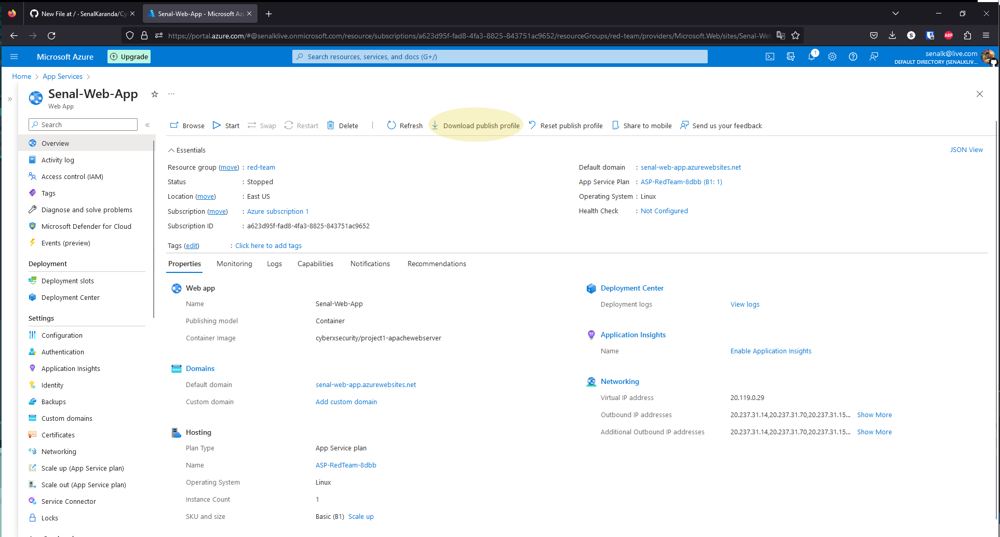

# How to Cove Your Project Blog from Azure ➡️ GitHub


## Prerequisite Steps (REQUIRED)
<div>
  <ul>
    <li>Download Filezilla from <a href="https://filezilla-project.org/download.php?type=client">here</a> and install it!</li>
    <li>Log into Azure Portal.</li>
  </ul>
</div>

## Step 1: 
### In Azure, navigate to ```App Services```


## Step 2: 
### Navigate to your Web App


## Step 3: 
### Navigate to the ```SSH``` tab and press ```Go```


## Step 4: 
### Enter the following exactly as it appears:
```cp -R /var/www/html /home/site/wwwroot/MySite```


## Step 5: 
### In Azure, navigate to ```App Services``` and your Web App


## Step 6: 
### Press ```Download Publish Profile``` on the upper bar



## Step 7: 
### Navigate to your ```Downloads``` folder
### Open the new file with Notepad. What you're looking for is the url, username, and password for FTP.
### This will be located right after ```publishMethod="FTP"``` (There are multiple url/user/pwd combos, you only want the one for FTP)
#### Use the image below as a reference:


## Step 8: 
### Copy the username, pwd, and url into another empty text file


## Step 9: 
### Open Filezilla, paste in the info at the top, and press ```QuickConnect```
### (The ```publishUrl``` is used for the ```host``` field)


## Step 10: 
### On the right half of Filezilla, navigate to the ```MySite``` folder
### (Located at ```/site/wwwroot/MySite```)
### You'll see your site's ```index.html``` file


## Step 11:
### Right click your ```index.html``` and press ```Download```


## Step 12:
### You've successfully downloaded your index file!


## Step 13:
### Head to GitHub and log in
### Press the ➕ icon at the top right, and press ```New repository```


## Step 14:
### Give the repo a name and a description
### Make sure the repo is public, and press ```Create repository```


## Step 15: 
### Press ```uploading an existing file```


## Step 16:
### Press ```choose your files```, and upload your ```index.html``` 
### Make sure to press ```Commit changes```


## Step 17: 
### Congrats, you've successfully copied your site files to a Github Repo!


